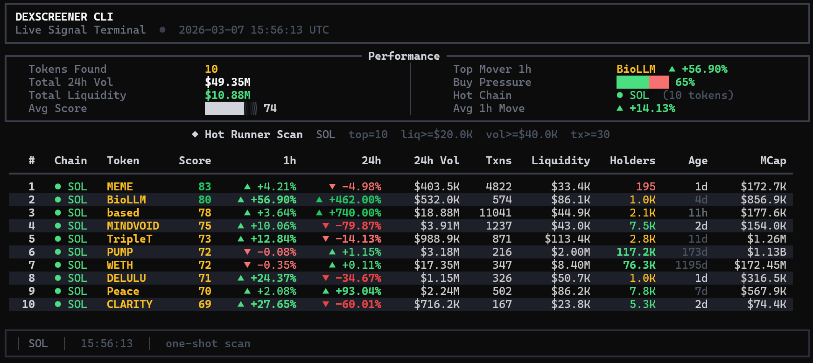

# PyAgenT 🚀

[](https://www.python.org/downloads/)
[](https://opensource.org/licenses/MIT)
[](https://fastapi.tiangolo.com/)
[](https://github.com/astral-sh/ruff)

> **AI-native cryptocurrency token scanner** with triple-interface architecture: CLI + MCP Server + Web Dashboard

```
┌─────────────────────────────────────────────────────────────┐
│  PyAgenT                                                    │
│  ├── CLI (Typer/Rich)        → Terminal power users         │
│  ├── MCP Server              → AI agents (Claude/Codex)     │
│  └── Web Dashboard (React)   → Browser-based control        │
└─────────────────────────────────────────────────────────────┘
```

**Live Demo Screenshot:**



## ✨ What Makes This Special

| Feature | Description |
|---------|-------------|
| **8-Factor Scoring Engine** | Proprietary algorithm weighing volume velocity, breakout readiness, momentum decay, flow pressure, and more |
| **Triple Interface** | Same core engine, three ways to interact: terminal, AI agents, or browser |
| **MCP Native** | Built for the Model Context Protocol — your AI assistant can scan tokens in natural language |
| **Multi-Chain** | Solana, Base, Ethereum, BSC, Arbitrum, Polygon, Optimism, Avalanche |
| **Real-Time Pipelines** | Live dashboards with SSE streaming, keyboard controls, and auto-refresh |
| **Smart Rate Limiting** | Sliding-window limiter with exponential backoff handles 60-300 RPM gracefully |

## 🚀 Quick Start

```bash
# Clone & install
git clone https://github.com/your-username/pyagentt.git
cd pyagentt
./install.sh        # or install.bat on Windows

# Run it
./pyagentt setup    # Configure your preferences (30 seconds)
./pyagentt hot      # See what's trending right now
```

**One-liner for live tracking:**
```bash
./pyagentt new-runners-watch --chain=solana --watch-chains=solana,base --profile=discovery --interval=2
```

## 🏗️ Architecture

```
┌─────────────────────────────────────────────────────────────────┐
│                        INTERFACES                               │
├──────────────┬──────────────────┬───────────────────────────────┤
│   CLI        │   MCP Server     │   Web API (FastAPI)           │
│   (Typer)    │   (FastMCP)      │   + React Frontend            │
└──────┬───────┴────────┬─────────┴───────────────┬───────────────┘
       │                │                         │
       └────────────────┴───────────┬─────────────┘
                                    │
                    ┌───────────────▼───────────────┐
                    │      CORE ENGINE            │
                    │  ┌───────────────────────┐  │
                    │  │   HotScanner          │  │
                    │  │   - Token discovery   │  │
                    │  │   - 8-factor scoring  │  │
                    │  │   - Risk profiling    │  │
                    │  └───────────────────────┘  │
                    │  ┌───────────────────────┐  │
                    │  │   DexScreenerClient   │  │
                    │  │   - Sliding limiter   │  │
                    │  │   - TTL caching       │  │
                    │  │   - Multi-provider    │  │
                    │  └───────────────────────┘  │
                    └─────────────────────────────┘
                                    │
                    ┌───────────────▼───────────────┐
                    │      DATA SOURCES           │
                    │  DexScreener • GeckoTerminal │
                    │  Blockscout • Honeypot.is    │
                    │  Moralis (optional)          │
                    └─────────────────────────────┘
```

## 🎮 Three Ways to Use

### 1. CLI (Terminal Power Users)

```bash
# One-shot scans
./pyagentt hot --chains solana,base --limit 20
./pyagentt search pepe
./pyagentt inspect So11111111111111111111111111111111111111112 --chain solana

# Live dashboards
./pyagentt watch --chain solana --interval 5
./pyagentt new-runners-watch --profile discovery --max-age-hours 48
./pyagentt alpha-drops-watch --chains base --discord-webhook-url YOUR_URL
```

**Interactive Controls (Live Mode):**
- `1/2` — Switch between chains
- `s` — Cycle sort modes
- `j/k` — Navigate rows
- `c` — Copy address to clipboard
- `Ctrl+C` — Exit

### 2. MCP Server (AI Agents)

Configure in Claude Desktop:

```json
{
  "mcpServers": {
    "pyagentt": {
      "command": "/path/to/pyagentt/.venv/bin/pyagentt-mcp"
    }
  }
}
```

Then just ask:
- *"What's pumping on Solana right now?"*
- *"Find me degen plays on Base with low liquidity"*
- *"Set up a task to scan for AI tokens every 5 minutes and alert me on Discord"*

**15 MCP Tools Available:**
- `scan_hot_tokens` — Core scanning with 8-factor scoring
- `search_pairs` — Token lookup by name/address
- `inspect_token` — Deep-dive analysis
- `create_task` — Scheduled scans with alerts
- `run_due_tasks` — Batch execution
- `export_state_bundle` — Backup/restore
- And 9 more...

### 3. Web Dashboard (Browser)

```bash
./pyagentt-web
# Open http://127.0.0.1:8765
```

Features:
- 🔥 One-shot scans with profile filters
- 📊 Live SSE streaming dashboard
- 🔍 Search + inspect panels
- ⏰ Task management & scheduling
- ⚙️ MCP config generation

## 📊 The 8-Factor Scoring Algorithm

```python
Score = (volume_velocity × 30) +
        (transaction_velocity × 20) +
        (liquidity_depth × 18) +
        (momentum × 12) +
        (flow_pressure × 8) +
        (boost_velocity × 7) +
        (recency × 3) +
        (profile_boost × 2)
```

**Risk-Adjusted Output:**
- Risk profiling detects low liquidity, thin exits, concentration risk
- Penalties applied for fast momentum decay, one-way flows
- Final score: **0-100** (80+ = very hot, 60-80 = interesting)

## 🔧 Technical Highlights

### Rate Limiting & Resilience
- **Sliding-window limiter** per API bucket (slow/fast)
- **Exponential backoff** with jitter for 429/5xx errors
- **TTL caching** (default 10s) to minimize API pressure
- **Circuit breaker pattern** for degraded providers

### Multi-Provider Holder Data

| Chain | Primary | Fallback 1 | Fallback 2 |
|-------|---------|------------|------------|
| Solana | GeckoTerminal | Moralis | — |
| Ethereum | GeckoTerminal | Moralis | Blockscout |
| Base | GeckoTerminal | Moralis | Blockscout |
| BSC/Arbitrum/Polygon | GeckoTerminal | Moralis | Honeypot.is |

### Async Architecture
```python
# Concurrent token discovery
semaphore = asyncio.Semaphore(20)  # Bounded concurrency
results = await asyncio.gather(*(worker(seed) for seed in ordered_seeds))

# Streaming SSE endpoint
async def watch_stream():
    while True:
        rows = await runtime.scan(filters)
        yield f"event: scan\ndata: {json.dumps(rows)}\n\n"
        await asyncio.sleep(interval)
```

## 📁 Project Structure

```
pyagentt/
├── pyagentt_cli/
│   ├── cli.py              # Typer CLI commands (1,000+ lines)
│   ├── mcp_server.py       # MCP server (15 tools, 3 prompts)
│   ├── web_api.py          # FastAPI endpoints (20+ routes)
│   ├── scanner.py          # Core HotScanner engine
│   ├── scoring.py          # 8-factor algorithm
│   ├── client.py           # DexScreener client with limiter
│   ├── models.py           # Pydantic dataclasses
│   ├── state.py            # Persistent presets/tasks
│   ├── task_runner.py      # Scheduled execution
│   ├── alerts.py           # Discord/Telegram/webhooks
│   ├── holders.py          # Multi-provider holder aggregation
│   ├── ui.py               # Rich terminal rendering
│   └── watch_controls.py   # Keyboard input handling
├── web/
│   ├── index.html          # React dashboard
│   └── assets/
│       └── app.jsx         # Frontend logic
├── tests/
│   ├── test_scanner.py
│   ├── test_scoring.py
│   ├── test_mcp_server.py
│   ├── test_web_api.py
│   └── test_security.py
├── pyproject.toml
└── README.md
```

## 🧪 Testing

```bash
# Run all tests
pytest

# With coverage
pytest --cov=pyagentt_cli --cov-report=html

# Security audit
pip-audit
```

**Test Coverage Areas:**
- Scanner engine & scoring algorithm
- MCP server tool execution
- Web API endpoints (FastAPI TestClient)
- Rate limiting & caching logic
- State persistence & task scheduling
- Security validations (SSRF, path traversal)

## ⚙️ Configuration

Environment variables (`.env`):
```bash
# Optional: Better holder data (40K req/month free)
MORALIS_API_KEY=your_key_here

# Optional: Override defaults
DS_CACHE_TTL_SECONDS=10
DS_TABLE_MODE=compact
```

## 📈 Performance

| Metric | Value |
|--------|-------|
| Scan Latency | ~2-4 seconds for 20 tokens |
| API Throughput | 60-300 RPM (bucket-dependent) |
| Memory Footprint | ~50MB baseline |
| Concurrent Tasks | 20 parallel workers |
| Cache Hit Rate | ~60-80% in live mode |

## 🤝 Integration Ideas

Combine PyAgenT with:
- **RugCheck.xyz / GoPlus** — Safety verification
- **Jupiter / 1inch** — Trade execution
- **n8n / Zapier** — No-code automations
- **Telegram/Discord bots** — Community alerts

## 📜 License

MIT — Free to use, modify, and distribute.

## 🙋 FAQ

**Q: Do I need API keys?**  
A: No. Everything works with free public APIs. Optional Moralis key unlocks better holder data.

**Q: Is this financial advice?**  
A: No. This is a research tool. Always DYOR (Do Your Own Research).

**Q: Can I use this for trading bots?**  
A: Yes — JSON output (`--json`) makes it easy to pipe into your bot.

**Q: What chains are supported?**  
A: Solana, Base, Ethereum, BSC, Arbitrum, Polygon, Optimism, Avalanche.

---

<p align="center">
  <b>Built with Python, caffeine, and curiosity.</b><br>
  <a href="https://github.com/your-username/pyagentt">⭐ Star this repo</a> if you find it useful!
</p>
